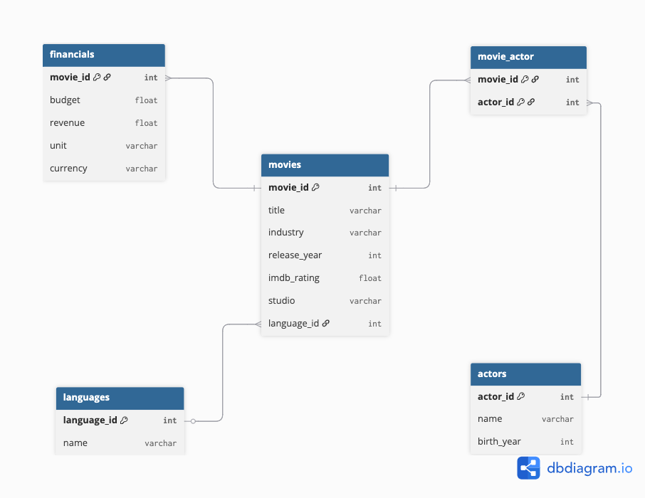

# Data Analysis using SQL (MySQL)

## 1. Project Overview

This project demonstrates **data analysis using SQL on a relational movie dataset**.
The analysis explores movie metadata, actor participation, language distribution, industry trends, and financial performance.

The workflow progresses from **basic data exploration to advanced analytical techniques**, including joins, aggregations, Common Table Expressions (CTEs), and window functions.

The goal of the project is to demonstrate **practical SQL skills used in real-world data analysis scenarios**.

---

## 2. Project Highlights

- Exploratory analysis of movie dataset structure
- Actor participation analysis using many-to-many relationships
- Financial data normalization across different units and currencies
- Profitability analysis of movies
- Ranking and trend analysis using **Window Functions**
- Clean and structured SQL script with documented insights

---

## 3. Project Objectives

The primary objectives of this project are:
- Explore and understand the structure of a relational movie dataset
- Analyze movie production across industries and languages 
- Examine actor participation and popularity 
- Standardize financial data across different units and currencies 
- Evaluate movie profitability 
- Demonstrate advanced SQL techniques including **CTEs and Window Functions**

---

## 4. Dataset Information & Credit
### 4.1 Data Source

The dataset used in this project was provided as part of the course **Gen AI & Data Science Bootcamp**, conducted by **Codebasics**.

Full credit goes to the **Mr. Dhaval Patel** and the Codebasics team for providing the dataset and learning resources.

> **Note:** The dataset is not publicly available and is therefore not included in this GitHub repository due to sharing restrictions.

This project is created strictly for educational and portfolio demonstration purposes.

### 4.2 Database Structure

The dataset consists of five relational tables:

- movies — contains movie metadata
- financials — contains budget and revenue information
- actors — contains actor details
- movie_actor — bridge table linking actors and movies
- languages — contains language information

The `movie_actor` table resolves the many-to-many relationship between movies and actors.

---

## 5. Tools & Technologies Used

- **SQL**
- **MySQL**
- **dbdiagram.io** (for ER diagram design)

---

## 6. Project Structure & Workflow

### 6.1 Folder Structure

- data_analysis_using_sql/
    - data_analysis.sql
    - ER_diagram.png
    - README.md

### 6.2 Project Workflow

- Data exploration
- Dataset relationship analysis
- Actor participation analysis
- Financial data normalization
- Financial performance analysis
- Advanced SQL queries using CTE
- Analytical queries using Window Functions

---

## 7. Database Schema (ER Diagram)

The dataset follows a relational schema connecting movies, actors, languages and financial information.

---

## 8. Data Cleaning & Transformations

Before performing financial analysis, the dataset required **standardization of financial values**.

### 8.1 Unit Standardization

Financial values appear in multiple units:
- Billions 
- Millions 
- Thousands

All values were converted to **millions** using conditional logic.

Example transformation:

    Billions → value × 1000  
    Thousands → value ÷ 1000  
    Millions → unchanged

### 8.2 Currency Standardization

Financial values appear in two currencies:
- USD
- INR

To ensure comparability:

    USD values were converted to INR equivalent using a multiplier of 90.

### 8.3 Final Standardized Columns

Two derived columns were created:

- **budget_millions**
- **revenue_millions**

These values are rounded to **two decimal places** for consistency.

---

## 9. SQL Analysis Queries

The SQL script is organized into structured analytical sections.

### 9.1 Data Exploration

Basic queries to understand the dataset.

Examples:
- Total number of movies 
- Total number of actors 
- Movies released per year 
- Movie distribution by industry

### 9.2 Language Distribution

Analyzes movie production by language.

Example insight:
- Which languages dominate movie production in the dataset.

### 9.3 IMDb Rating Analysis

Examines movie quality using ratings.

Examples:
- Top 10 highest rated movies
- Average rating by industry

### 9.4 Studio Analysis

Identifies studios responsible for the highest number of movie productions.

### 9.5 Actor Participation Analysis

Explores actor involvement in movies.

Examples:
- Actors appearing in each movie
- Actors with the most movie appearances
- Actors appearing in highly rated movies

Movies with multiple actors are handled using **GROUP_CONCAT**.

### 9.6 Financial Performance Analysis

Evaluates financial success of movies using standardized financial values.

Examples:
- Top movies by budget
- Top movies by revenue
- Most profitable movies

Profit is calculated as:

    profit_millions = revenue_millions − budget_millions

### 9.7 Common Table Expressions (CTE)

CTEs simplify complex financial calculations and allow reusable query logic.

Example:

    Calculating movie profit using standardized financial values.

### 9.8 Window Functions

Advanced SQL analytics using window functions.

Examples:

- Ranking movies by revenue
- Ranking movies by IMDb rating
- Identifying the top movie within each industry
- Cumulative movie releases by year

Window functions used:

    RANK()
    DENSE_RANK()
    SUM() OVER()

---

## 10. Key Insights

Key insights discovered through the analysis:

- Hollywood movies tend to have **larger production budgets**.
- A **small group of actors appear in many movies**, indicating star concentration.
- **Higher budgets do not always produce higher IMDb ratings**.
- Certain studios dominate movie production.
- Financial success varies significantly across industries.

---

# 11. Key Takeaways

- Proper **data normalization is critical for accurate financial analysis**.
- SQL can effectively analyze relational datasets without requiring additional tools.
- Window functions enable powerful analytical capabilities directly in SQL.
- Structured SQL queries can extract meaningful insights from complex datasets.

---

# 12. Skills Demonstrated

This project demonstrates the following SQL and data analysis skills:

- Relational database querying
- Handling many-to-many relationships
- Data transformation using `CASE`
- Aggregation and grouping
- Financial data normalization
- Common Table Expressions (CTEs)
- Window Functions for ranking and trend analysis
- Analytical SQL query design
- Extracting insights from structured data

---

# 13. Final Conclusion

This project showcases how SQL can be used to perform **end-to-end data analysis on a relational dataset**. By combining exploratory queries, data transformation techniques, and advanced analytical functions, meaningful insights about the movie industry can be extracted.

The project demonstrates practical SQL skills applicable to **data analyst and analytics engineering workflows**.

